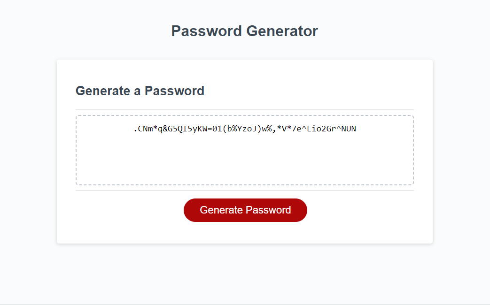

# Password-Generator - Module 3 Challenge

##Description

A password generator to generate passwords with the following input from the user:
- Length of password (MUST be between 8 and 128)
- Whether lowercase characters should be included
- Whether uppercase characters should be included
- Whether numbers should be included
- Whether special characters should be included

##Usage

Can be used by a user to generate random passwords for different websites based on the criteria required by the website.

##Credits

W3Schools

##Screenshot

 
##Link to deployed application

https://mdpais.github.io/Password-Generator/

##License

None